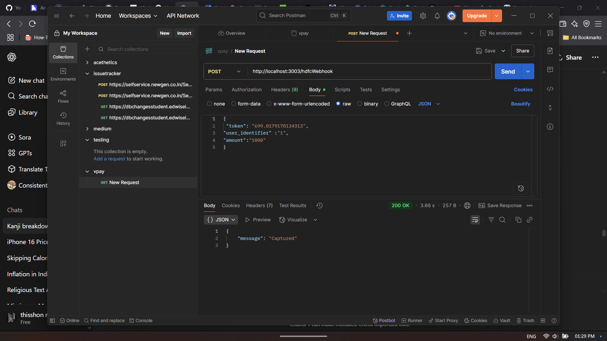
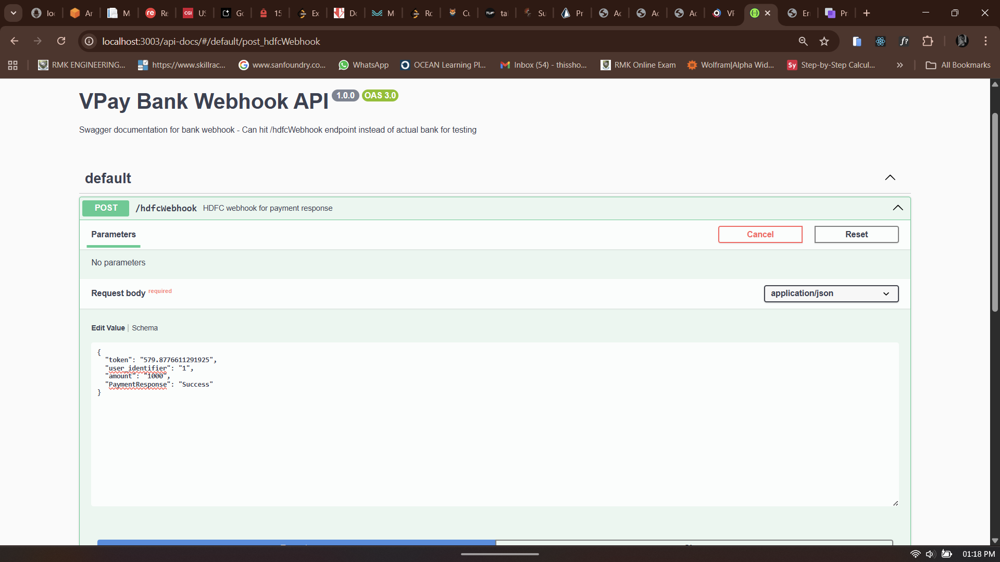
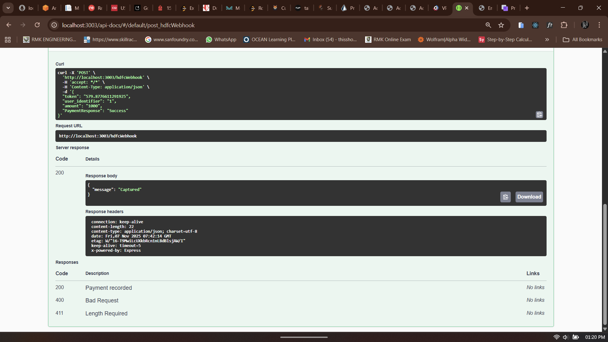

todo:
    landing Page
    websockets

TEST Login
name:alice
number:1111111111      (1 *10)
gmail:alice@gmail.com
password:alice
  

    VPay – Architecture & Flow
Overview
VPay is a monorepo wallet application built with a modern stack (Next.js, Express, Prisma, PostgreSQL, Tailwind, and a custom UI library). It supports user authentication, wallet balance management, on-ramp (add money), P2P transfers, and transaction history, with a modular architecture for scalability.

High-Level Architecture
Monorepo: Managed by Turborepo, with apps (user-app, bank-webhook) and packages (db, ui, store, etc.).
Database: PostgreSQL, managed via Prisma ORM (db).
Backend:
user-app: Next.js app for user dashboard, authentication, and wallet features.
bank-webhook: Express server to handle bank callbacks for on-ramp transactions.
UI: Custom component library (ui) using Tailwind CSS and Radix UI.
State Management: Recoil (planned), React context/hooks.
API: Next.js API routes for user actions, with rate limiting and authentication.
Main Features & Flow
1. User Authentication
Uses NextAuth for session management.
Users log in with a phone number and password.
2. Dashboard
Shows user greeting, balance (unlocked, locked, total), and transaction summaries.
Graphical view of monthly transactions.
3. Add Money (On-Ramp)
User selects a bank and amount.
Creates an on-ramp transaction (status: Processing).
Redirects to a simulated netbanking screen (apps/user-app/app/bankfrontend) where the user clicks "Approve payment" or "Decline".
That click fires a real browser fetch() to the webhook (see "Bank Webhook" below for what actually receives it now).

4. P2P Transfer
User enters recipient's number and amount.
Backend validates recipient, checks balance, and performs atomic transfer (debit sender, credit receiver, create transfer record).
Rate limiting is enforced per IP.
Transaction status is updated (Success/Failure).
5. Transaction History
On-Ramp Transactions: Shows recent add-money events with status and provider.
P2P Transactions: Shows last 5 sent/received transfers, with direction, amount, and counterparties.
All Transactions: Tabular view of all user transactions.
6. Bank Webhook
The real trigger in the app is apps/user-app/app/bankfrontend/bank-content.tsx: the mock netbanking screen's "Approve payment" button calls `${NEXT_PUBLIC_WEBHOOK_URL}/hdfcWebhook` directly from the browser. Postman/Swagger (below) are manual ways to send the same payload for testing — not how it's triggered during a normal add-money flow.

As of this build, `NEXT_PUBLIC_WEBHOOK_URL` no longer points straight at bank-webhook. It points at a serverless idempotency layer in front of it — see "Serverless webhook gateway" below for why and how.

sample Postman Post Req (still works for manual testing):
{
  "token": "232.23011382469227",
  "user_identifier": "2",
  "amount": "10000", -->(RS.100)
  "PaymentResponse":"Success"
}

Validates payload, updates user balance and transaction status.
Codebase Structure

ALTERNBATIVE APPROACH 

Serverless webhook gateway (API Gateway + Lambda + DynamoDB + S3)
Problem: the original bank-webhook handler had no protection against duplicate delivery. If the same `{token, PaymentResponse: Success}` payload arrived twice (a retried request, a double click, a replayed test), the balance was incremented twice, because the update was never conditioned on whether that token had already been processed.

Fix: `NEXT_PUBLIC_WEBHOOK_URL` now points at an API Gateway HTTP API instead of bank-webhook directly. Both `/webhook` and `/hdfcWebhook` routes are wired to one Lambda (`vpay-webhook-idempotency`):
1. Lambda checks DynamoDB (`vpay-webhook-idempotency` table, partition key `token`) for that token.
2. If it's already been seen: return success immediately, stop. Nothing is forwarded again.
3. If it's new: write a raw JSON backup of the payload to S3 (`vpay-webhook-audit-*` bucket), write a record to DynamoDB (with a 90-day TTL so old rows expire automatically), then forward the exact same payload on to the real bank-webhook `/hdfcWebhook` endpoint, unchanged.

bank-webhook itself was not modified — this is an additive layer in front of it, not a rewrite. Rewriting bank-webhook's Prisma logic to run inside Lambda directly was considered and skipped, since it would mean solving Prisma's binary-engine packaging for the Lambda runtime, which wasn't worth the risk for what this layer needed to do.

user-app: Next.js frontend (dashboard, auth, API routes).
bank-webhook: Express server for bank callbacks.
db: Prisma schema, client, and seed scripts.
ui: Shared UI components (Card, Button, Chart, etc.).
store: State management utilities.
docker: Dockerfiles for deployment.
Data Models (Prisma)
User: id, name, number, password, balances, on-ramp transactions, p2p transfers.
Balance: userId, amount, locked.
OnRampTransaction: userId, amount, status, provider, token.
p2pTransfer: fromUserId, toUserId, amount, status, timestamp.
Flow Diagram
User logs in → Dashboard loads (balance, transactions).
Add Money → Initiate on-ramp → Mock netbanking screen → Approve/Decline click fires webhook → API Gateway → Lambda (idempotency check via DynamoDB, audit copy to S3) → bank-webhook → Balance updated.
P2P Transfer → Enter recipient/amount → Backend validates & processes → Balances updated for both users.
Transactions → User views all transaction history.
Tech Stack
Frontend: Next.js, React, Tailwind CSS, Radix UI, custom UI library.
Backend: Next.js API routes, Express (webhook), Prisma, PostgreSQL.
Auth: NextAuth.js.
State: React hooks, Recoil (planned).
Dev Tools: Turborepo, ESLint, Prettier, Docker.

AWS SETUP

Can Run entire Turborepo in ec2 for simplification, but here dockerizing separately and adding workflows for learing.
ec2-t3micro
security group: open ssh,http,https ports

connect using keypair: chmod 400 Vpay-keypair.pem
                       cp Vpay-keypair.pem ~/.ssh/
                       ssh -i ~/.ssh/Vpay-keypair.pem ubuntu@"public-ip-address"
                       
ngnix:
server {
        server_name Vpay.starzc.com;

        location / {
            proxy_pass http://localhost:3005;
            proxy_http_version 1.1;
            proxy_set_header Upgrade $http_upgrade;
            proxy_set_header Connection 'upgrade';
            proxy_set_header Host $host;
            proxy_cache_bypass $http_upgrade;

        }

}

server {
        server_name vpaybankwebhook.starzc.com;

        location / {
            proxy_pass http://localhost:3003;
            proxy_http_version 1.1;
            proxy_set_header Upgrade $http_upgrade;
            proxy_set_header Connection 'upgrade';
            proxy_set_header Host $host;
            proxy_cache_bypass $http_upgrade;

        }
}
sudo docker system prune -f
sudo nginx -t
sudo nginx -s reload 
Install certbot for https :https://certbot.eff.org/instructions?ws=nginx&os=snap
free up space:
sudo docker images -a # List all images
sudo docker rmi $(sudo docker images -a -q) # Remove all images (be careful, this can remove active ones if not used correctly, better to use prune)

